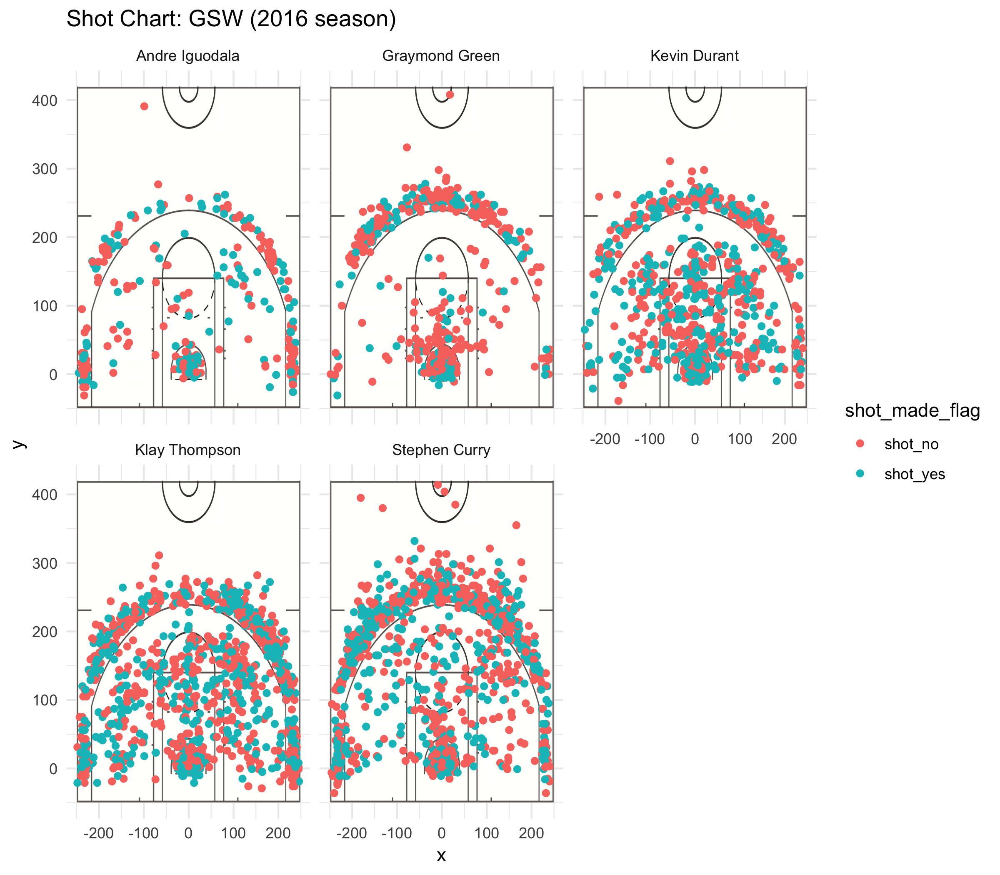

```{r echo = FALSE}
library(dplyr)
library(knitr)
global <- read.csv("../data/shots-data.csv", stringsAsFactors = FALSE)
global <- data.frame(global, stringsAsFactors = FALSE)
#global
```

```{r echo = FALSE}
cleaned <- select(global, shot_made_flag, shot_type, name)
two_PT <- filter(cleaned, shot_type == "2PT Field Goal")
three_PT <- filter(cleaned, shot_type == "3PT Field Goal")
two_grouped <- arrange(
                        summarise(
                                  group_by(two_PT, name), 
                                  total = n(),
                                  made = sum(shot_made_flag == "shot_yes"),
                                  perc_made = made / total
                        ), desc(perc_made)
                )
three_grouped <- arrange(
                        summarise(
                                  group_by(three_PT, name), 
                                  total = n(),
                                  made = sum(shot_made_flag == "shot_yes"),
                                  perc_made = made / total
                        ), desc(perc_made)
                )
full_grouped <- arrange(
                        summarise(
                                  group_by(cleaned, name), 
                                  total = n(),
                                  made = sum(shot_made_flag == "shot_yes"),
                                  perc_made = made / total
                        ), desc(perc_made)
                )
```


#Iguodala, Green, Durant, Thompson and Curry in 2016

###Introduction
The 2016 regular season has passed, but the competition during that season has never passed. In the season, as one of the best teams, Golden State Warriors has shown its outstanding strength and its players has also presented their amazing techniques. With this report, we are trying to know the value of the top five most valuable players, Andre Iguodala, Graymond Green, Kevin Durant, Klay Thompson and Stephen Curry, by analyzing their field goal percentages in the 2016 season. So who are the player who is really good at shooting?

In the 2016 regular season, players Andre Iguodala, Graymond Green, Kevin Durant, Klay Thompson and Stephen Curry contribute a lot for the team Golden State Warriors. During the whole year, in nearly every places on the court, they have scored points.

###Motivation
Why Andre Iguodala, Graymond Green, Kevin Durant, Klay Thompson and Stephen Curry are the top five most valuable players in Golden State Warriors? Why are they valuable? Among them, who are the player who goals the most? Do they deserve their fame?

###Background
#####2009–present: The Stephen Curry era
The Warriors chose future superstar point guard Stephen Curry of Davidson College with the seventh overall pick in the 2009 NBA draft. During the 2009 off-season, Warrior ownership declined to renew the contract of general manager Chris Mullin. Larry Riley, Nelson's longtime assistant coach, was promoted in his place; Riley drafted Curry and traded Jamal Crawford to the Atlanta Hawks for Acie Law and Speedy Claxton. (CR. Wikipedia)

###Data
```{r out.width = '80%', echo = FALSE, fig.align = 'center'}

```

##### Field Goal Percentage

```{r echo = FALSE}
kable(full_grouped)
```

#####2 Point Goal Percentage

```{r echo = FALSE}
kable(two_grouped)
```

#####3 Point Goal Percentage

```{r echo = FALSE}
kable(three_grouped)
```

###Analysis
Kevin Durant is the player who has the highest field goal percentage. He surpassed the four others by a percentage of nearly 54.1%.

Andre Iguodala is the player who has the highest 2 point goal percentage. He surpassed the four others by a percentage of nearly 63.8%.

Klay Thompson is the player who has the highest 3 point goal percentage. He surpassed the four others by a percentage of nearly 42.4%. 

Stephen Curry is the player who made the largest amount of shoots and also the player who goals the largest amount.

###Discussion
From the data and analysis above, Kevin Durant is not the player who has the highest 2 point goal percentage and 3 point goal percentage, but his field goal percentage is the highest among the five players, showing that he is the kind of player who is stable at both the 2 point and 3 point goals comparing to the other four players. Andre Iguodala's two goal percentage, which is the highest among the five, showing that he is really a valuable player as it is quite outstanding for players to get a 63.8% of goal percentage. This is also true for Thompson. Three points goals, especially in the fiercing competitive field, is really hard to get. In this kind of situation, he can still reaches 42.4% of goals, which could be said as something magnificent. And Stephen Curry, as the player who made the largest amount of shoots and also the player who goals the largest amount, perfectly shows his skills and techniques in his every trial of goal.

###Conclusions
From the data and following analysis, it is not hard to see that Andre Iguodala, Klay Thompson, Kevin Durant and Stephen Curry are really four outstanding players in NBA. Graymond Green, since not in the list, is not that strong as the other four players. But, the data is only about the percentage of goaling of these five players, and goal percentages are only a part of the process of getting the players' value. So, we can see that Andre Iguodala, Klay Thompson, Kevin Durant and Stephen Curry are all good at goaling and they are all trying hard and showing their skills in the 2016 season, and they have all helped the Golden State Warriors to be the today's Golden State Warriors.

###References
 "Golden State Warriors". *Wikipedia.* 10 March 2019. Retrieved March 13, 2019.